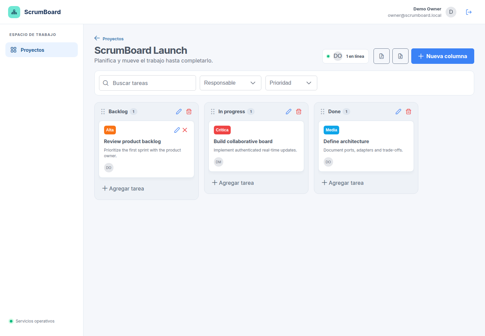
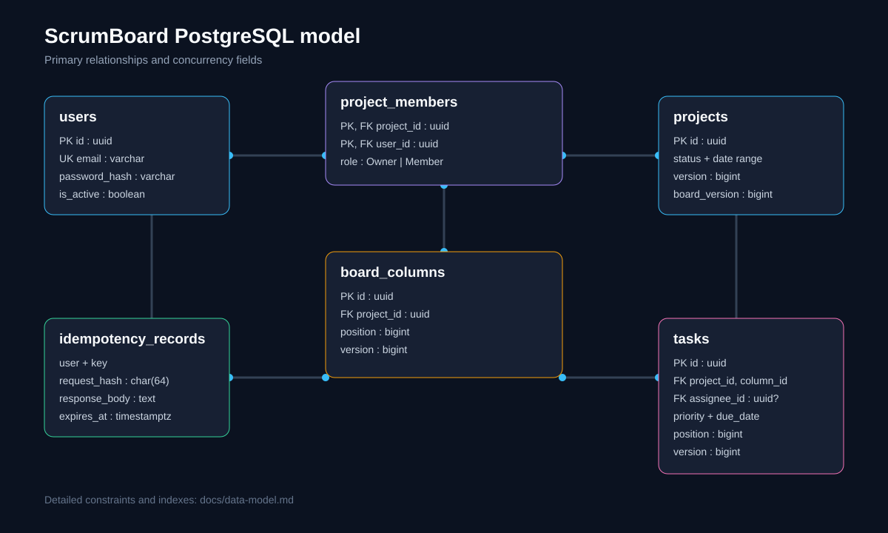

# ScrumBoard

ScrumBoard administra proyectos y tableros Scrum con una API ASP.NET Core 8, una SPA Angular 17 basada en PrimeNG y el shell Sakai, PostgreSQL y actualizaciones SignalR. La interfaz está en español (`es-EC`), responde a escritorio y móvil, y aplica concurrencia optimista, POST idempotentes y reportes PDF/XLSX.

## Requisitos

Para la ejecución recomendada:

- Docker Engine 24 o posterior con Docker Compose v2.
- Al menos 2 GB de memoria disponibles para los contenedores.
- Puertos `8080` (web) y `5000` (API) libres, o valores alternativos en `.env`.

Para desarrollo sin contenedores:

- .NET SDK indicado en `global.json` (canal .NET 8).
- Node.js 20 y npm.
- PostgreSQL 16.
- Google Chrome para Karma y Playwright.

## Inicio rápido

1. Cree la configuración local a partir del ejemplo:

   ```bash
   cp .env.example .env
   ```

2. Cambie al menos `POSTGRES_PASSWORD` y `JWT_SIGNING_KEY`. Para conservar el acceso de demostración, no cambie `PASSWORD_PEPPER`: los hashes sembrados se generaron con ese valor de desarrollo.

   PostgreSQL solo usa `POSTGRES_PASSWORD` al inicializar el volumen. Si reutiliza un volumen existente, conserve su contraseña original o rótela explícitamente dentro de PostgreSQL; cambiar únicamente `.env` hará que el migrador no pueda autenticarse, pero no elimina ni modifica los datos.

3. Construya e inicie el entorno:

   ```bash
   docker compose up --build
   ```

4. Abra `http://localhost:8080`. La API queda en `http://localhost:5000`, Scalar en `http://localhost:5000/scalar/v1` y OpenAPI en `http://localhost:5000/swagger/v1/swagger.json`.

El servicio `migrator` es intencionalmente de una sola ejecución: espera a PostgreSQL, aplica migraciones y termina con código `0`. La API solo inicia si esa ejecución finaliza correctamente. Compruebe el estado con:

```bash
docker compose ps
docker compose logs migrator
curl --fail http://localhost:5000/health/ready
```

Para detener el entorno use `docker compose down`. Para eliminar también los datos locales use `docker compose down --volumes`; esta última operación es destructiva.

Si cambia `API_PORT` o `FRONTEND_PORT`, ajuste también `API_PUBLIC_URL`, `HUB_PUBLIC_URL` y `FRONTEND_ORIGIN`, porque las URL del frontend son consumidas por el navegador y no por la red interna de Docker.

## Desarrollo directo, sin contenedores

Use una instancia PostgreSQL 16 accesible y una cuenta con permisos para crear tablas, índices y la extensión `pg_trgm`. Defina la configuración obligatoria con valores locales propios; los marcadores siguientes no son secretos utilizables:

```bash
export ConnectionStrings__Database='<cadena Npgsql con Host, Port, Database, Username y Password>'
export Jwt__Issuer='<issuer local>'
export Jwt__Audience='<audience local>'
export Jwt__SigningKey='<clave local aleatoria de al menos 32 caracteres>'
export Password__Pepper='<pepper local aleatorio de al menos 16 caracteres>'
export BootstrapAdmin__Enabled='true'
export BootstrapAdmin__Name='<nombre local>'
export BootstrapAdmin__Email='<correo local>'
export BootstrapAdmin__Password='<contraseña local>'
export ASPNETCORE_URLS='http://127.0.0.1:5000'
```

`Jwt__LifetimeMinutes` es opcional y debe estar entre 5 y 120; el valor predeterminado es 30. `Password__Iterations` también es opcional y no puede ser menor que 100000; la configuración incluida usa 210000. Al habilitar `BootstrapAdmin`, el migrador reemplaza las credenciales del owner sembrado con los valores locales y desactiva el miembro demo; así el pepper puede ser propio. `BootstrapAdmin__RemoveDemoWorkspace` es opcional y debe permanecer `false` para conservar el tablero de ejemplo.

Aplique primero la historia EF Core con el ejecutable dedicado y, solo si termina correctamente, inicie la API:

```bash
dotnet run --project src/ScrumBoard.Migrator/ScrumBoard.Migrator.csproj --no-launch-profile
dotnet run --project src/ScrumBoard.Api/ScrumBoard.Api.csproj --no-launch-profile
```

El archivo de runtime del frontend usa rutas relativas `/api` y `/hubs/boards`. Para `ng serve`, cree un proxy temporal fuera del repositorio y arranque Angular:

```bash
printf '%s\n' '{"/api":{"target":"http://127.0.0.1:5000","secure":false},"/hubs":{"target":"http://127.0.0.1:5000","secure":false,"ws":true}}' > /tmp/scrumboard-proxy.json
cd frontend
npm ci
npm start -- --host 127.0.0.1 --port 4200 --proxy-config /tmp/scrumboard-proxy.json
```

Abra `http://127.0.0.1:4200`. `RuntimeConfigService` es un singleton de raíz y su `APP_INITIALIZER` carga una sola vez `assets/app-config.json` antes de que los servicios construyan URLs; no hay configuración de endpoints duplicada por feature.

## Credenciales de demostración

| Rol | Correo | Contraseña |
| --- | --- | --- |
| Propietario | `owner@scrumboard.local` | `ScrumBoard123!` |
| Miembro | `member@scrumboard.local` | `ScrumBoard123!` |

Estas cuentas y la contraseña son exclusivamente para desarrollo. El job cloud reemplaza las credenciales del propietario con secretos del ambiente, desactiva el miembro demo y elimina el workspace de ejemplo en production. Nunca use los secretos de `.env.example` fuera del entorno local.

La autorización efectiva se aplica en el backend:

| Operación | Owner | Member |
| --- | --- | --- |
| Listar/consultar un proyecto propio, leer tablero y miembros, descargar reportes y suscribirse a SignalR | Sí | Sí |
| Crear un proyecto, convirtiéndose en su owner | Sí | Sí |
| Editar o eliminar el proyecto | Sí | No |
| Crear, editar, mover o eliminar columnas | Sí | No |
| Crear, editar, mover o eliminar tareas | Sí | Sí |

Una tarea siempre requiere responsable y este debe ser miembro del mismo proyecto; la fecha límite es opcional. Los formularios Angular validan campos obligatorios, espacios, longitudes y fechas para respuesta inmediata, pero la API vuelve a validar contratos y casos de uso y la base preserva las invariantes. El backend es la autoridad incluso si se omite o altera la validación del navegador.

## Arquitectura

La solución sigue una separación por capas:

- `ScrumBoard.Domain`: entidades, invariantes y ordenamiento.
- `ScrumBoard.Application`: modelos neutrales, puertos `Inbound`/`Outbound` y casos de uso, sin dependencias de frameworks o DI.
- `ScrumBoard.Infrastructure`: adaptadores de salida y configuración de EF Core/Npgsql, JWT, PBKDF2, tiempo y reportes PDF/XLSX.
- `ScrumBoard.Api`: adaptador de entrada HTTP, adaptador bidireccional SignalR, idempotencia técnica, composition root, Problem Details, autenticación, rate limiting y salud.
- `ScrumBoard.Migrator`: ejecutable independiente que aplica migraciones antes del arranque.
- `frontend`: SPA Angular/PrimeNG con shell Sakai adaptable, servida por nginx no privilegiado y con configuración de endpoints en tiempo de ejecución.

La API y el migrador se publican en imágenes multi-stage y se ejecutan como el usuario no privilegiado de .NET. El frontend usa `nginx-unprivileged` como UID 101. La base de datos es el único componente con volumen persistente.

Consulte [el diagrama de arquitectura](docs/architecture.md) y [el modelo de datos](docs/data-model.md).

## Azure Container Apps

El ciclo cloud usa `develop` para staging y `main` para production. GitHub Actions publica imágenes GHCR inmutables, ejecuta el job de migración antes del rollout y valida la revisión activa mediante healthchecks y login. Consulte [la guía completa de Azure y DevOps](docs/azure-deployment.md).

## API y endpoints

Todas las rutas funcionales usan el prefijo `/api/v1`. Salvo la creación de sesión y los checks de salud, requieren `Authorization: Bearer <token>`.

| Método | Ruta | Propósito |
| --- | --- | --- |
| `POST` | `/api/v1/sessions` | Autenticar y obtener un JWT. |
| `GET`, `POST` | `/api/v1/projects` | Listar con paginación/filtros o crear proyectos. |
| `GET`, `PUT`, `DELETE` | `/api/v1/projects/{projectId}` | Consultar, actualizar o eliminar un proyecto. |
| `GET` | `/api/v1/projects/{projectId}/board` | Obtener el tablero; acepta `assigneeId`, `priority`, `search` y `taskLimit`. |
| `GET` | `/api/v1/projects/{projectId}/members` | Listar miembros y roles. |
| `POST` | `/api/v1/projects/{projectId}/columns` | Crear una columna. |
| `GET` | `/api/v1/projects/{projectId}/columns/{columnId}/tasks` | Cargar la siguiente página de tareas de una columna. |
| `PUT`, `PATCH`, `DELETE` | `/api/v1/projects/{projectId}/columns/{columnId}` | Editar, mover o eliminar una columna. |
| `POST` | `/api/v1/projects/{projectId}/tasks` | Crear una tarea. |
| `PUT`, `PATCH`, `DELETE` | `/api/v1/projects/{projectId}/tasks/{taskId}` | Editar, mover o eliminar una tarea. |
| `GET` | `/api/v1/projects/{projectId}/reports?format=pdf` | Descargar un reporte `pdf` o `xlsx`, con los filtros del tablero. |
| `GET` | `/health/live`, `/health/ready` | Comprobar proceso y disponibilidad de PostgreSQL, respectivamente. |
| WebSocket/HTTP | `/hubs/boards` | Hub autenticado de SignalR. |

La lista de proyectos acepta `page`, `pageSize`, `search`, `sort` y `direction`; también devuelve `X-Total-Count`. El tablero carga inicialmente 20 tareas por columna. Cada columna continúa mediante el cursor `(afterPosition, afterTaskId)`, ordenado de forma determinista por `(position, id)`, y exige el ETag del tablero en `If-Match` para no mezclar páginas de snapshots diferentes. `taskLimit` y `limit` aceptan de 1 a 50; el frontend usa 20 por página y el máximo no limita la cantidad total de tareas del tablero.

La lectura inicial usa una transacción PostgreSQL `REPEATABLE READ` y un número constante y acotado de consultas, independiente del número de columnas: proyecto/autorización, miembros y columnas con conteo y hasta `taskLimit + 1` tareas correlacionadas. No existe caché dinámica del tablero; cada snapshot autorizado se obtiene de PostgreSQL. Los errores se presentan como RFC 9457 Problem Details en español e incluyen código de dominio y `traceId` cuando corresponde. OpenAPI es la fuente exacta para cuerpos y respuestas.

## Concurrencia

Los proyectos, columnas y tareas tienen una versión persistida y el proyecto mantiene además `board_version`. Las mutaciones `PUT`, `PATCH` y `DELETE`, y la continuación paginada de una columna, exigen un `If-Match` fuerte: una única etiqueta numérica entre comillas. No se aceptan etiquetas débiles, `*` ni listas.

```http
If-Match: "3"
```

- Sin `If-Match`, la API responde `428 Precondition Required`.
- Con una versión obsoleta, responde `412 Precondition Failed`.
- Editar/eliminar proyecto, columna o tarea usa el ETag de esa entidad. Mover columnas o tareas y paginar una columna usa el ETag global del tablero.
- El `GET` del tablero y las páginas de tareas devuelven el ETag del tablero. Las mutaciones de columna/tarea devuelven el ETag de entidad en `ETag` y la nueva versión agregada en `X-Board-ETag` y en el cuerpo.
- El orden de columnas y tareas usa posiciones espaciadas y rebalanceo cuando ya no existe espacio entre vecinos.

El cliente debe volver a leer el recurso después de un `412`, reconciliar los cambios y reintentar de forma explícita; no debe sobrescribir silenciosamente el trabajo de otra persona.

## Idempotencia

Los `POST` autenticados marcados como idempotentes aceptan `Idempotency-Key` de 1 a 100 caracteres. La clave es única por usuario durante su vigencia. El fingerprint SHA-256 incorpora método, plantilla y valores de ruta, query ordenada, tipo de contenido y bytes del cuerpo.

- Repetir la misma clave y el mismo cuerpo reproduce status, cuerpo, tipo de contenido, `Location`, `ETag` y `X-Board-ETag`, y añade `Idempotency-Replayed: true`.
- Reutilizar la clave para cualquier solicitud distinta, incluso en otra ruta, responde `409 Conflict`.
- Una solicitud concurrente aún en proceso también responde `409 Conflict`.
- Las respuestas no exitosas no se conservan.
- Una reserva en proceso tiene un lease de cinco minutos; al completarse, el replay permanece vigente durante 24 horas. Los registros vencidos dejan de bloquear la clave; una limpieza periódica en lote figura en el roadmap.
- La mutación y la respuesta replay se confirman en una transacción; SignalR se publica después del commit y sus fallos no revierten una operación durable.

En integraciones reales, genere una clave aleatoria por intención de negocio y conserve la misma clave únicamente durante reintentos de esa intención.
La SPA sigue ese ciclo en los diálogos de creación: genera la clave al iniciar una intención y la conserva mientras el usuario reintenta esa misma operación.

## Tiempo real

El frontend se conecta a `/hubs/boards` con el JWT y llama `SubscribeToBoard(projectId)`. El servidor valida la membresía antes de agregar la conexión al grupo. Application produce notificaciones tipadas y el adaptador SignalR las traduce a `ColumnChanged`, `TaskCreated`, `TaskUpdated`, `TaskMoved`, `TaskDeleted` y `PresenceChanged`.

La presencia se mantiene en memoria y por conexión; al desconectarse se limpian todas sus suscripciones. Cada snapshot lleva una versión creciente y el cliente ignora actualizaciones antiguas. Por eso Compose ejecuta una API y Azure fija una réplica: con dos procesos, grupos, presencia y secuencias de versión divergirían.

Para escalar horizontalmente se evaluaron Azure SignalR Service o un backplane Redis para el fan-out, junto con presencia y versionado distribuidos; el backplane por sí solo no resuelve la presencia local. Para notificaciones durables se requiere además un outbox transaccional y un publicador con reintentos, porque la publicación SignalR actual ocurre después del commit y es deliberadamente best effort.

## Reportes

`GET /api/v1/projects/{projectId}/reports` genera descargas PDF o XLSX. Admite `assigneeId`, `priority` y `search`; una única consulta SQL autoriza al miembro, obtiene metadatos y tareas en orden `(column.position, column.id, task.position, task.id)`, y pide como máximo 10001 filas para rechazar reportes superiores al límite síncrono de 10000 tareas. Un filtro sin coincidencias conserva los metadatos y genera un reporte vacío válido.

Ambos formatos comparten semántica en español: título y metadatos del proyecto, estados/prioridades traducidos, cabeceras `Tarea`, `Columna`, `Responsable`, `Prioridad`, `Creada` y `Vence`, y `Periodo evaluado: tareas históricas hasta hoy` con la fecha local de generación. Las fechas sin hora permanecen como fecha; los timestamps se convierten al timezone local del host y se muestran como `dd/MM/yyyy HH:mm`. Como marcas de identificación, el PDF usa `ScrumBoard` en el fondo con paginación y el XLSX lo incluye en encabezado/pie de impresión; además, XLSX conserva fechas nativas, autofiltro y filas congeladas.

Los exportadores son singletons sin estado detrás de `IReportExporter`; el caso de uso selecciona por `Format`, por lo que añadir otro formato consiste en implementar y registrar otro adaptador sin cambiar el caso de uso. La consulta es asíncrona, pero la construcción final de `byte[]` es síncrona y acotada dentro de la solicitud. Para volúmenes mayores, la alternativa es un job en cola que persista filtros y autorización, genere fuera del request, publique el resultado en almacenamiento temporal protegido y exponga estado/descarga con expiración.

## Seguridad y secretos

- JWT firmado simétricamente, con issuer/audience y expiración de 30 minutos por defecto.
- Contraseñas derivadas con PBKDF2, 210 000 iteraciones, sal individual y pepper externo.
- CORS restringido al origen configurado y autorización por membresía/rol.
- Rate limit global de 120 solicitudes por minuto por usuario o IP.
- IDs de correlación, Problem Details y trazabilidad OpenTelemetry instrumentada.
- Imágenes de aplicación no privilegiadas, filesystem de API/migrador de solo lectura y `no-new-privileges` en Compose.
- PostgreSQL no publica su puerto al host en la topología predeterminada.

En producción, inyecte secretos desde el gestor de secretos de la plataforma, use claves aleatorias largas, TLS extremo a extremo, rotación de credenciales y un usuario PostgreSQL con privilegios separados para migración y ejecución. El Compose local sirve HTTP; no representa por sí solo un despliegue público endurecido.

[//]: # (pending)
### Riesgo conocido de Angular 17

`npm audit --omit=dev` reporta 10 vulnerabilidades altas en la línea Angular/PrimeNG exigida por el reto. La corrección automática disponible migra a Angular 22 y rompe la restricción de Angular 17, por lo que no se aplicó de forma encubierta. Esta SPA no usa SSR, `HttpTransferCache`, plantillas dinámicas ni HTML proporcionado por usuarios, lo que reduce la exposición de varios avisos, pero no elimina la deuda. CI bloquea nuevas vulnerabilidades críticas y el salto de versión está registrado en el roadmap.

## Desarrollo y pruebas

Backend:

```bash
dotnet restore ScrumBoard.sln
dotnet build ScrumBoard.sln --configuration Release --no-restore
dotnet test ScrumBoard.sln --configuration Release --no-build --collect:"XPlat Code Coverage"
```

La solución .NET cubre invariantes de dominio, validación y permisos de casos de uso, contratos HTTP, ETags/idempotencia, exportadores, reglas de arquitectura y persistencia/migraciones sobre PostgreSQL real. Las pruebas de integración usan Testcontainers, por lo que Docker debe estar disponible. La descripción evita fijar un total de casos que quedaría obsoleto al agregar pruebas.

Las migraciones viven con el adaptador PostgreSQL en `src/ScrumBoard.Infrastructure/Adapters/Outbound/Persistence/Migrations` y se aplican únicamente mediante `ScrumBoard.Migrator`, antes de iniciar la API. La migración incremental más reciente es `20260806021724_RequireTaskAssigneeAndAddChecks`: repara responsables nulos o ajenos al proyecto asignándolos al owner determinista, falla si no existe owner y luego hace obligatorio el responsable y crea FKs compuestas, checks e índices endurecidos. No es necesario recrear volúmenes anteriores que ya tengan la historia versionada; `docker compose down --volumes` se reserva para borrar intencionalmente todos los datos locales.

La estrategia y el orden de migraciones están documentados en [arquitectura](docs/architecture.md#historia-de-migraciones).

Frontend:

```bash
cd frontend
npm ci
npm test -- --watch=false --browsers=ChromeHeadlessNoSandbox
npm run build -- --configuration production
```

Playwright, para la entrada responsive sin backend:

```bash
cd frontend
npx playwright install chrome
npm run e2e
```

Con el stack de demostración completo, la misma suite habilita todos los escenarios sembrados:

```bash
cd frontend
PLAYWRIGHT_BASE_URL=http://127.0.0.1:8080 E2E_DEMO=true npm run e2e
```

La suite no fija su documentación a un número de casos. Cubre login, shell/tablero a 320 px sin overflow del documento, autorización de `Member` tanto en UX como frente a una mutación HTTP directa, descarga PDF conservando filtros y colaboración SignalR: abre contextos aislados para owner/member, crea una tarea asignada al miembro, comprueba que aparezca sin navegar ni recargar y elimina la tarea en el teardown.

La automatización en `.github/workflows/ci.yml` restaura, compila y prueba .NET; audita dependencias runtime, prueba y compila Angular; construye las tres imágenes; y bloquea vulnerabilidades corregibles de severidad alta o crítica encontradas por Trivy.

## Evidencia visual

Tablero autenticado ejecutándose sobre el stack completo:



Modelo de datos PostgreSQL (la definición detallada está en [`docs/data-model.md`](docs/data-model.md)):



## Roadmap

El estado actual, deuda técnica y próximos incrementos están en [`docs/ROADMAP.md`](docs/ROADMAP.md).

## Declaración de uso de IA

Se utilizó un asistente de IA (OpenCode con un modelo de OpenAI) como apoyo en el análisis, implementación, pruebas, contenedores, CI y documentación. Las decisiones de arquitectura, la revisión del resultado y la responsabilidad sobre el código publicado permanecen a cargo del autor del proyecto.
