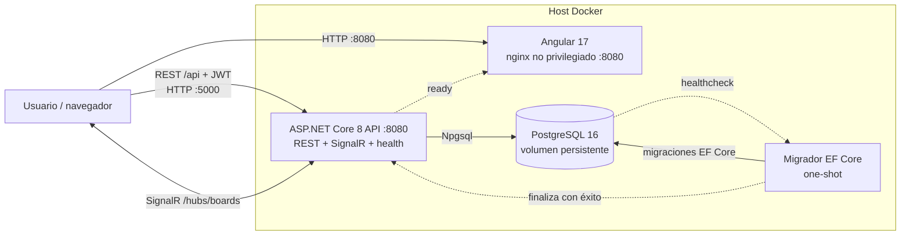
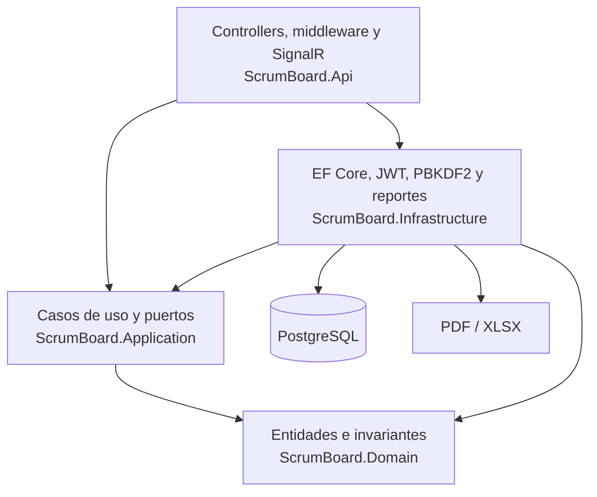
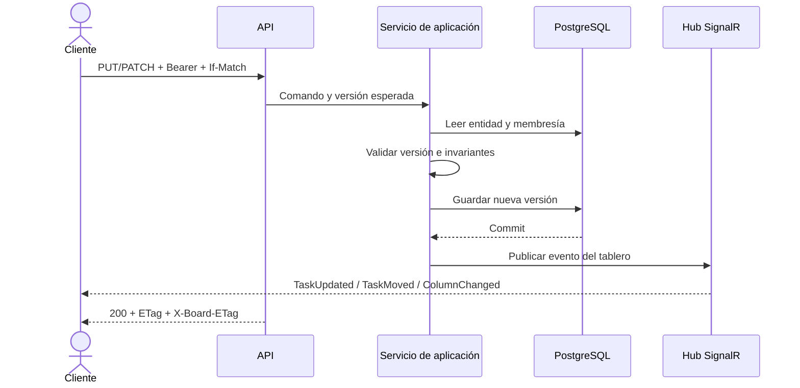

# Arquitectura

## Vista de contenedores

El frontend recibe `API_BASE_URL` y `HUB_URL` al iniciar el contenedor. Esas URL deben ser accesibles desde el navegador, no solo desde la red interna de Compose.

## Capas del backend

Las dependencias de código apuntan hacia dominio y aplicación. Infraestructura implementa los puertos y la API compone el proceso. El migrador reutiliza el contexto de infraestructura sin acoplar la migración al arranque web.

## Flujo de una mutación

Para `POST` autenticados, el middleware de idempotencia envuelve este flujo, identifica usuario/ruta/clave, compara el hash del cuerpo y conserva únicamente respuestas exitosas.

## Decisiones operativas

- PostgreSQL determina disponibilidad mediante `pg_isready`.
- El migrador espera una base sana y debe finalizar antes de la API.
- La API expone checks HTTP y el frontend espera a que esté listo.
- API y migrador usan filesystem de solo lectura con `/tmp` efímero.
- La presencia SignalR es local al proceso; una segunda réplica requiere estado distribuido.
- `/health/live` comprueba el proceso sin depender de PostgreSQL; `/health/ready` incluye la conectividad con la base de datos.
