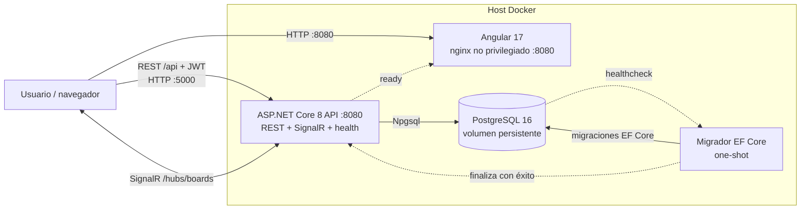
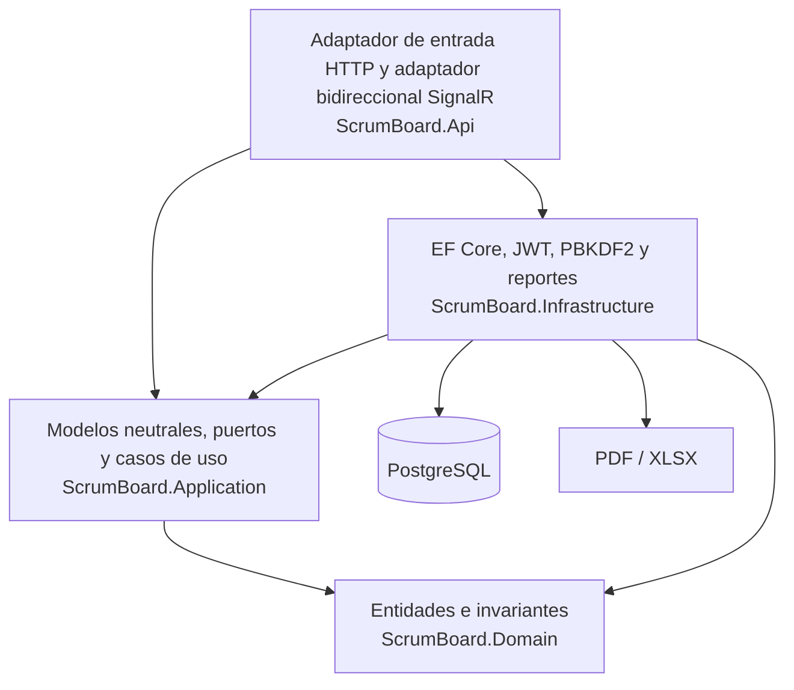
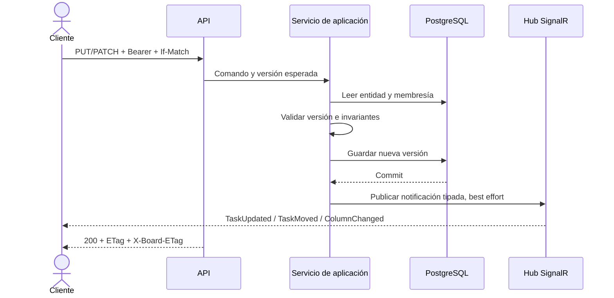

# Arquitectura

## Vista de contenedores

El frontend recibe `API_BASE_URL` y `HUB_URL` al iniciar el contenedor. Esas URL deben ser accesibles desde el navegador, no solo desde la red interna de Compose.

## Capas del backend

La estructura hace explícita la arquitectura hexagonal: `Application/Ports/Inbound` contiene comandos e interfaces invocados por los adaptadores de entrada; `Application/Models` contiene criterios, proyecciones y notificaciones neutrales compartidas; `Application/UseCases` contiene la lógica; y `Application/Ports/Outbound` define persistencia, seguridad, tiempo, reportes y notificaciones. Infrastructure implementa los adaptadores durables y externos. API contiene el adaptador HTTP, el adaptador técnico bidireccional SignalR y el composition root. El migrador reutiliza el contexto de infraestructura sin acoplar la migración al arranque web.

Las dependencias de compilación apuntan hacia el núcleo:

- `Domain` no referencia ningún proyecto de la solución.
- `Application` referencia únicamente `Domain`, sin paquetes de DI ni frameworks; los casos de uso implementan puertos de entrada y consumen puertos de salida.
- `Infrastructure` referencia `Application` y `Domain` para implementar adaptadores de salida.
- `Api` es simultáneamente host y composition root. Sus controladores dependen de puertos de entrada; `Program` referencia Infrastructure para registrar implementaciones y comprobar PostgreSQL.
- `Migrator` es otro host y solo orquesta el adaptador de persistencia para aplicar la historia EF Core.

Los puertos Outbound no importan contratos Inbound. Los criterios y resultados que necesitan ambos lados residen en `Application/Models`. El usuario actual se representa como contexto de ejecución de Application y es suministrado por el host HTTP. Los nombres de eventos y payloads SignalR se traducen exclusivamente dentro de `Api/Adapters/SignalR`; Application publica notificaciones tipadas.

Los tests siguen la misma responsabilidad: invariantes bajo `UnitTests/Domain`, casos de uso bajo `UnitTests/Application/UseCases`, reglas de dependencias en `ArchitectureTests` y PostgreSQL real bajo `IntegrationTests/Adapters/Outbound/Persistence`.

## Flujo de una mutación

Para los `POST` autenticados marcados como idempotentes, el middleware envuelve el flujo. La clave es global por usuario y el fingerprint incluye operación canónica, valores concretos de ruta, query ordenada, tipo de contenido y cuerpo; usar la misma clave para otra solicitud produce conflicto. La reserva obtiene primero un lease de cinco minutos para excluir ejecuciones concurrentes; después, la mutación y la respuesta replay se guardan en una única transacción. Las notificaciones SignalR se difieren hasta después del commit. Una desconexión o un fallo de tiempo real posterior no elimina la reserva completada ni permite repetir la mutación. El replay conserva durante 24 horas el status, cuerpo textual exacto, tipo de contenido, `Location`, `ETag` y `X-Board-ETag`.

La fila `idempotency_records` es un modelo técnico de persistencia dentro de Infrastructure, no una entidad de Domain ni un puerto de Application. El middleware depende de un coordinador técnico local de API; los controladores y casos de uso permanecen ajenos a EF y a la mecánica HTTP de replay.

## Decisiones operativas

- PostgreSQL determina disponibilidad mediante `pg_isready`.
- El migrador espera una base sana y debe finalizar antes de la API.
- La API expone checks HTTP y el frontend espera a que esté listo.
- API y migrador usan filesystem de solo lectura con `/tmp` efímero.
- La presencia SignalR es local al proceso, se serializa por snapshot, incluye una versión creciente y se indexa por conexión para limpiar todos sus proyectos al desconectarse; una segunda réplica requiere estado distribuido.
- `/health/live` comprueba el proceso sin depender de PostgreSQL; `/health/ready` incluye la conectividad con la base de datos.

## Historia de migraciones

Las migraciones se organizan como cambios incrementales y reversibles, en orden de dependencia:

1. `CreateUsers` crea identidad y su índice único de correo.
2. `CreateProjects` crea proyectos y membresías.
3. `CreateBoard` crea columnas y tareas como agregado de tablero.
4. `CreateIdempotencyRecords` añade la persistencia operativa de solicitudes.
5. `SeedDemoUsers` incorpora únicamente las cuentas de demostración.
6. `SeedDemoWorkspace` incorpora el proyecto, membresías, columnas y tareas de ejemplo.
7. `AddSearchIndexes` habilita `pg_trgm` y añade índices GIN específicos de PostgreSQL.
8. `AddIdempotencyReplayHeaders` conserva los ETags de entidad y tablero para reproducir respuestas completas.
9. `HardenIdempotencyRecords` hace global la clave por usuario y almacena el cuerpo replay como texto exacto.

El esquema no se modifica al arrancar la API. `ScrumBoard.Migrator` consulta y aplica las migraciones pendientes como proceso de una sola ejecución, y Compose condiciona el arranque de la API a su salida correcta.

Esta secuencia reemplaza la historia inicial usada durante el desarrollo. Una base local creada con identificadores de migración anteriores debe recrearse con `docker compose down --volumes` antes de arrancar la nueva versión; no se intenta compatibilidad con volúmenes de desarrollo descartables.
