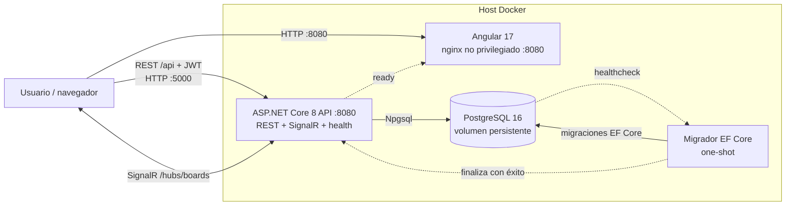
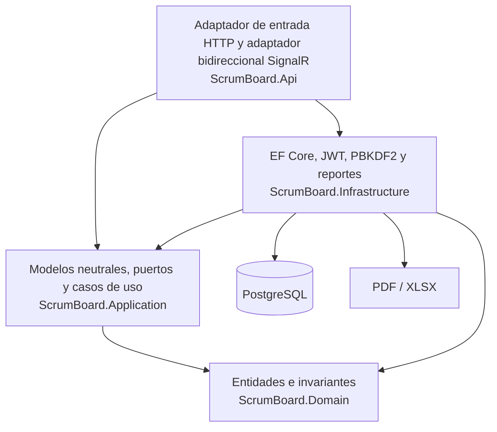
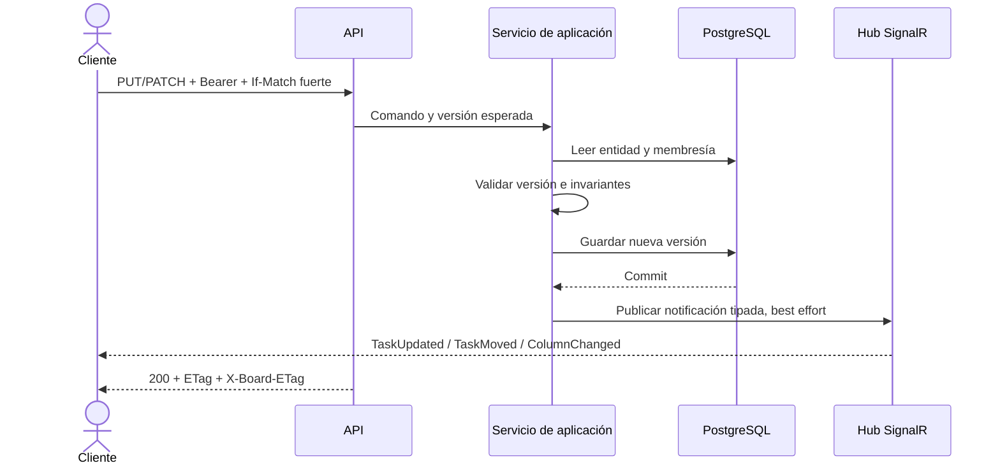

# Arquitectura

## Vista de contenedores

El frontend recibe `API_BASE_URL` y `HUB_URL` al iniciar el contenedor. Esas URL deben ser accesibles desde el navegador, no solo desde la red interna de Compose.

La SPA usa Angular 17 standalone, PrimeNG/PrimeFlex/PrimeIcons y una adaptación del shell Sakai. El layout pasa a menú lateral superpuesto por debajo de 800 px, las tablas usan presentación apilada y los diálogos se acotan al viewport. Angular registra `es-EC` y PrimeNG recibe traducciones españolas, calendario con lunes como primer día y formato `dd/mm/yy`.

`RuntimeConfigService` se registra `providedIn: 'root'`: existe una sola instancia para autenticación, REST y SignalR. Un `APP_INITIALIZER` carga `assets/app-config.json` antes de usar sus endpoints. La imagen nginx materializa ese archivo desde la plantilla al arrancar, de modo que la misma compilación sirve distintos ambientes sin recompilar.

## Capas del backend

La estructura hace explícita la arquitectura hexagonal: `Application/Ports/Inbound` contiene comandos e interfaces invocados por los adaptadores de entrada; `Application/Models` contiene criterios, proyecciones y notificaciones neutrales compartidas; `Application/UseCases` contiene la lógica; y `Application/Ports/Outbound` define persistencia, seguridad, tiempo, reportes y notificaciones. Infrastructure implementa los adaptadores durables y externos. API contiene el adaptador HTTP, el adaptador técnico bidireccional SignalR y el composition root. El migrador reutiliza el contexto de infraestructura sin acoplar la migración al arranque web.

Las dependencias de compilación apuntan hacia el núcleo:

- `Domain` no referencia ningún proyecto de la solución.
- `Application` referencia únicamente `Domain`, sin paquetes de DI ni frameworks; los casos de uso implementan puertos de entrada y consumen puertos de salida.
- `Infrastructure` referencia `Application` y `Domain` para implementar adaptadores de salida.
- `Api` es simultáneamente host y composition root. Sus controladores dependen de puertos de entrada; `Program` referencia Infrastructure para registrar implementaciones y comprobar PostgreSQL.
- `Migrator` es otro host y solo orquesta el adaptador de persistencia para aplicar la historia EF Core.

Los puertos Outbound no importan contratos Inbound. Los criterios y resultados que necesitan ambos lados residen en `Application/Models`. El usuario actual se representa como contexto de ejecución de Application y es suministrado por el host HTTP. Los nombres de eventos y payloads SignalR se traducen exclusivamente dentro de `Api/Adapters/SignalR`; Application publica notificaciones tipadas.

Los tests siguen la misma responsabilidad: invariantes bajo `UnitTests/Domain`, casos de uso bajo `UnitTests/Application/UseCases`, reglas de dependencias en `ArchitectureTests` y PostgreSQL real bajo `IntegrationTests`. Karma cubre componentes/servicios Angular y Playwright usa el stack sembrado para móvil, autorización, descarga y una colaboración SignalR con owner/member en contextos de navegador separados y limpieza posterior.

## Validación y autorización

La validación del formulario Angular mejora la respuesta de la interfaz, pero no es una frontera de confianza. Los DTO HTTP validan forma, rangos y enums; Application repite las reglas relevantes y membresía; Domain protege construcción/transiciones; PostgreSQL impone nulabilidad, FKs y checks. Los mensajes de API se normalizan como Problem Details en español. En particular, `assignee_id` es obligatorio, debe identificar una membresía del mismo proyecto y `due_date` puede ser nulo.

La matriz del backend es deliberadamente pequeña: cualquier usuario autenticado puede crear un proyecto y queda como `Owner`; owner y member pueden leer su proyecto/tablero, exportar y mutar tareas; solo owner puede editar/eliminar el proyecto o mutar columnas. La suscripción al grupo SignalR vuelve a comprobar membresía. Los recursos de proyectos ajenos se ocultan como `404`, mientras que una operación no permitida de un miembro conocido devuelve `403`.

## Lectura del tablero

El snapshot inicial abre una transacción `REPEATABLE READ` y ejecuta tres lecturas independientemente del número de columnas: proyecto con membresía y `board_version`, miembros ordenados y columnas con conteo y colección correlacionada de hasta `taskLimit + 1`. Así se detecta `hasMoreTasks` sin N+1 ni materializar el tablero completo. No hay caché dinámica: cada snapshot autorizado consulta PostgreSQL.

El valor predeterminado es 20 tareas por columna y el backend admite entre 1 y 50. Las columnas y tareas se ordenan por `(position, id)`; los índices `ix_board_columns_project_position` y `ix_tasks_column_position` incluyen el `id` de desempate. La página siguiente usa cursor `(afterPosition, afterTaskId)`, mantiene los filtros y exige como `If-Match` el ETag del tablero leído. Un cambio de `board_version` produce `412`, evitando unir páginas de snapshots distintos.

## Flujo de una mutación

Para los `POST` autenticados marcados como idempotentes, el middleware envuelve el flujo. La clave es global por usuario y el fingerprint incluye operación canónica, valores concretos de ruta, query ordenada, tipo de contenido y cuerpo; usar la misma clave para otra solicitud produce conflicto. La reserva obtiene primero un lease de cinco minutos para excluir ejecuciones concurrentes; después, la mutación y la respuesta replay se guardan en una única transacción. Las notificaciones SignalR se difieren hasta después del commit. Una desconexión o un fallo de tiempo real posterior no elimina la reserva completada ni permite repetir la mutación. El replay conserva durante 24 horas el status, cuerpo textual exacto, tipo de contenido, `Location`, `ETag` y `X-Board-ETag`.

La fila `idempotency_records` es un modelo técnico de persistencia dentro de Infrastructure, no una entidad de Domain ni un puerto de Application. El middleware depende de un coordinador técnico local de API; los controladores y casos de uso permanecen ajenos a EF y a la mecánica HTTP de replay.

`If-Match` acepta exactamente una etiqueta fuerte numérica (`"<versión>"`): se rechazan etiqueta débil, wildcard y listas. Ediciones/eliminaciones usan la versión de la entidad. Los movimientos, que afectan orden agregado, y la continuación paginada usan `board_version`. Las mutaciones de columnas/tareas responden con ambos niveles: `ETag` de entidad y `X-Board-ETag` agregado.

## Reportes

`ReportDataSource` construye una sola consulta SQL con autorización, metadatos, filtros y `LEFT JOIN` de tareas. El orden es determinista por columna y tarea, y `Take(10001)` permite distinguir el máximo síncrono de 10000 sin una segunda consulta ni carga ilimitada. Después del I/O asíncrono, `IReportExporter.Export` crea un `byte[]` de forma síncrona en la solicitud. Este patrón es apropiado para el límite actual: simplifica entrega HTTP y mantiene PDF/XLSX como adaptadores singleton sin estado.

`ReportPresentation` y `ReportDateFormatter` dan paridad semántica a ambos adaptadores: vocabulario y seis cabeceras en español, metadatos, periodo evaluado hasta el día local del host y conversión local de timestamps. Como marcas de identificación, el PDF coloca `ScrumBoard` en el fondo y XLSX en el encabezado/pie de impresión; PDF pagina y XLSX conserva fechas tipadas, autofiltro y congelación. El selector depende de la colección `IEnumerable<IReportExporter>`, de modo que un formato nuevo implementa y registra el puerto sin modificar el caso de uso (OCP).

La alternativa para superar el límite no es aumentar memoria dentro del request: sería un comando idempotente que crea un job, persiste el criterio y la identidad autorizada, procesa en un worker, escribe en almacenamiento temporal privado y devuelve un recurso de estado con descarga expirable. Deben definirse retención, cancelación, cuotas y revalidación de acceso antes de implementarlo.

## Decisiones operativas

- PostgreSQL determina disponibilidad mediante `pg_isready`.
- El migrador espera una base sana y debe finalizar antes de la API.
- La API expone checks HTTP y el frontend espera a que esté listo.
- API y migrador usan filesystem de solo lectura con `/tmp` efímero.
- La presencia SignalR es local al proceso, se serializa por snapshot, incluye una versión creciente y se indexa por conexión para limpiar todos sus proyectos al desconectarse.
- `/health/live` comprueba el proceso sin depender de PostgreSQL; `/health/ready` incluye la conectividad con la base de datos.

La presencia local y los grupos del hub explican la topología de una réplica, no una limitación de PostgreSQL. Compose define un proceso API y Azure configura `maxReplicas: 1`; ejecutar dos instancias hoy dividiría conexiones, presencia y versiones. Para escalar se evaluaron Azure SignalR Service o Redis como backplane de fan-out, siempre acompañados por presencia/versionado distribuidos (por ejemplo Redis). Esto resuelve entrega entre réplicas, pero no durabilidad. Las notificaciones se publican best effort después del commit; un outbox en la misma transacción y un publicador reintentable es la alternativa para entrega durable.

## Historia de migraciones

Las migraciones se organizan como cambios incrementales y reversibles, en orden de dependencia:

1. `20260805022502_CreateUsers` crea identidad y su índice único de correo.
2. `20260805022520_CreateProjects` crea proyectos y membresías.
3. `20260805022539_CreateBoard` crea columnas y tareas como agregado de tablero.
4. `20260805022646_CreateIdempotencyRecords` añade la persistencia operativa de solicitudes.
5. `20260805022706_SeedDemoUsers` incorpora únicamente las cuentas de demostración.
6. `20260805022726_SeedDemoWorkspace` incorpora el proyecto, membresías, columnas y tareas de ejemplo.
7. `20260805022746_AddSearchIndexes` habilita `pg_trgm` y añade índices GIN específicos de PostgreSQL.
8. `20260805035300_AddIdempotencyReplayHeaders` conserva los ETags de entidad y tablero para reproducir respuestas completas.
9. `20260805042120_HardenIdempotencyRecords` hace global la clave por usuario y almacena el cuerpo replay como texto exacto.
10. `20260806021724_RequireTaskAssigneeAndAddChecks` repara responsables nulos o no miembros con el owner de menor UUID, falla si un proyecto afectado no tiene owner, hace `tasks.assignee_id` obligatorio y añade las FKs compuestas, checks e índices de orden determinista.

El esquema no se modifica al arrancar la API. `ScrumBoard.Migrator` consulta y aplica las migraciones pendientes como proceso de una sola ejecución, y Compose condiciona el arranque de la API a su salida correcta.

Esta es una historia incremental. Una base que ya tenga `20260805042120_HardenIdempotencyRecords` se actualiza en sitio mediante el migrador; no debe recrearse su volumen. `docker compose down --volumes` solo corresponde cuando se quiere descartar deliberadamente todos los datos locales. La API nunca llama `Migrate`; tanto Compose como Azure ejecutan `ScrumBoard.Migrator` y bloquean el arranque/rollout si falla.
