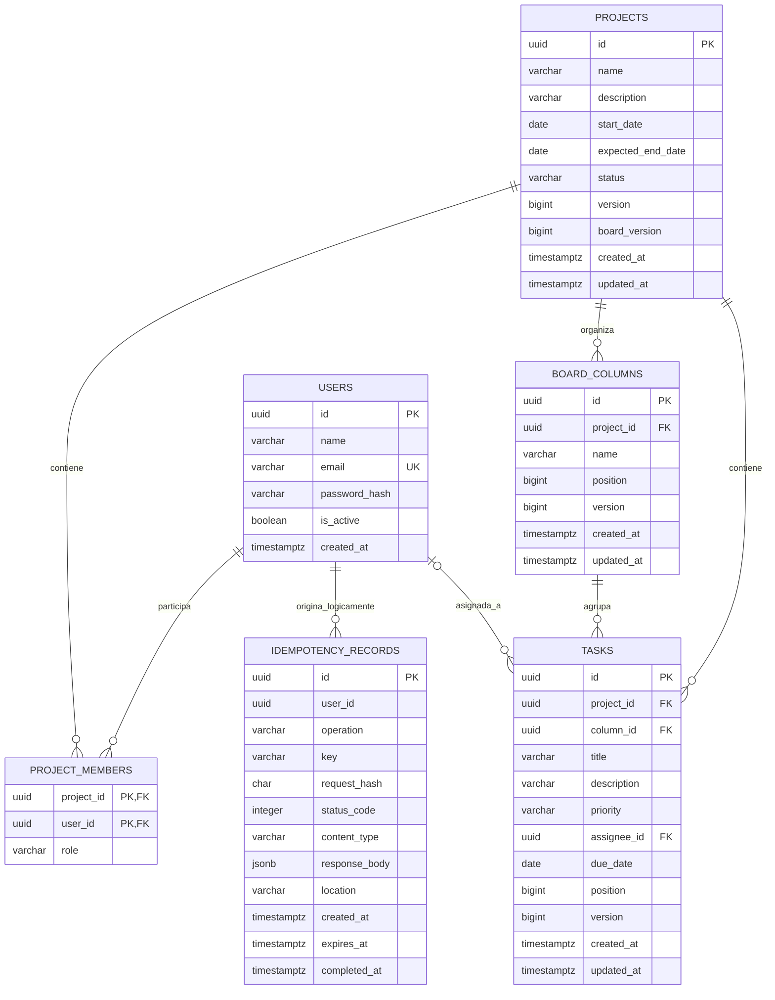

# Modelo de datos

## Diagrama entidad-relación

La última relación es lógica: `idempotency_records.user_id` forma parte del índice único, pero la configuración actual no declara una clave foránea hacia `users`.

## Integridad y concurrencia

- `project_members` usa clave primaria compuesta `(project_id, user_id)`.
- `board_columns` y `tasks` indexan sus posiciones para ordenar eficientemente; la serialización por `board_version` evita carreras entre movimientos.
- La fecha esperada de fin de un proyecto no puede ser anterior a su inicio.
- `version` es token de concurrencia en proyectos, columnas y tareas; `board_version` representa cambios agregados del tablero.
- El borrado de un proyecto elimina membresías, columnas y tareas; una columna con tareas no puede eliminarse y la FK de tareas es restrictiva.
- Al eliminar un usuario asignado, `tasks.assignee_id` pasa a `NULL`; las membresías restringen el borrado.
- La idempotencia tiene unicidad por `(user_id, operation, key)` e índice por `expires_at`.

## Índices de consulta

El modelo añade índices para correo, nombre/actualización de proyecto, membresía por usuario, tarea por asignado, tarea por prioridad y expiración idempotente. Estos índices corresponden a autenticación, listados, filtros del tablero y mantenimiento futuro.
