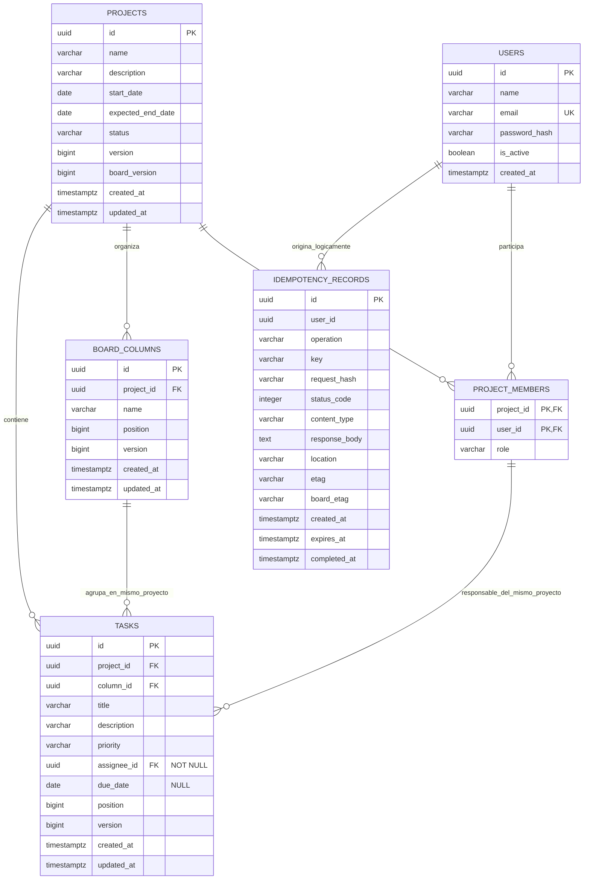

# Modelo de datos

## Diagrama entidad-relación

La relación de idempotencia es lógica: `idempotency_records.user_id` forma parte del índice único, pero la configuración actual no declara una clave foránea hacia `users`. En cambio, la asignación de tareas es física y compuesta: `(tasks.project_id, tasks.assignee_id)` referencia `(project_members.project_id, project_members.user_id)`.

## Integridad y concurrencia

- `project_members` usa PK `(project_id, user_id)` y restringe `role` a `Owner` o `Member`.
- `board_columns` expone la clave alternativa `(project_id, id)`. La FK `(tasks.project_id, tasks.column_id)` garantiza que una tarea no apunte a una columna de otro proyecto.
- `tasks.assignee_id` es `NOT NULL`; la FK `(project_id, assignee_id)` garantiza que el responsable sea miembro del mismo proyecto. `due_date` permanece opcional.
- La fecha esperada de fin no puede ser anterior al inicio; `status` se restringe a `Planned`, `Active`, `Completed` o `Archived`.
- `priority` se restringe a `Low`, `Medium`, `High` o `Critical`; posiciones y versiones deben ser positivas, y ambas versiones del proyecto deben ser mayores que cero.
- `version` es token de concurrencia en proyectos, columnas y tareas; `board_version` representa cambios agregados del tablero.
- Al borrar un proyecto, el repositorio elimina primero sus tareas y luego PostgreSQL aplica cascada a columnas y membresías. Una columna con tareas no puede eliminarse.
- Borrar una membresía usada como responsable está restringido; borrar un usuario con membresías también está restringido. No existe `SetNull` para responsables.
- La idempotencia tiene unicidad por `(user_id, key)` e índice por `expires_at`; `operation` y `request_hash` verifican que la clave no se reutilice para otra solicitud.

## Índices de consulta

Los recorridos ordenados tienen desempate estable e índices concordantes:

- `ix_board_columns_project_position` sobre `(project_id, position, id)`.
- `ix_tasks_column_position` sobre `(column_id, position, id)`.
- `IX_tasks_project_id_column_id` sobre `(project_id, column_id)` respalda la FK compuesta hacia columnas.
- `ix_project_members_user_id` sobre `(user_id, project_id)` para proyectos visibles.
- `ix_tasks_project_assignee` y `ix_tasks_project_priority` para filtros.
- `ix_projects_name`, `ix_projects_updated_at` y `ux_users_email` para listados/autenticación.
- GIN trigram `ix_projects_name_trgm`, `ix_tasks_title_trgm` e `ix_tasks_description_trgm` para búsquedas `ILIKE` literales.
- `ux_idempotency_user_key` e `ix_idempotency_expires_at` para replay y mantenimiento.

La migración `20260806021724_RequireTaskAssigneeAndAddChecks` actualiza bases existentes antes de activar estas restricciones. Toda tarea con responsable nulo o que no pertenezca al proyecto se reasigna al owner de menor UUID del proyecto; la migración aborta si no puede reparar una fila porque falta owner. Después cambia la columna a `NOT NULL`, sustituye las FKs antiguas y crea checks/índices. Por ser una reparación incremental, no requiere eliminar el volumen ni perder datos.
